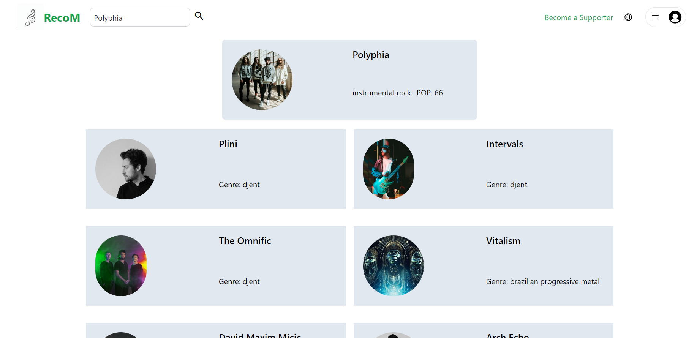

# RecoM music com Spotify Api

Acesso: https://fanciful-otter-1763da.netlify.app

#### Desenvolvedor(a)
Felipe Colpo Bagesteiro

#### Tecnologias

Preencha aqui uma lista detalhada de tecnologias usadas, por exemplo:
- HTML
- CSS/Tailwind
- Vue

#### Ambiente de desenvolvimento

Preencha aqui uma lista detalhada de ferramentas de desenvolvimento usadas, por exemplo:
- VS Code
- Postman

#### Créditos

Preencha aqui uma lista detalhada de recursos aproveitados no projeto, por exemplo:
- chat.openai.com
- Créditos para colegas que colaboraram - Leonardo da Veiga

#### Bastidores

O projeto teve diversas mudanças no caminho, mas o fator que mais influenciou foi o limite de requisições da Api do musicMatch, o que me levou a utilizar a api do spotify, a qual necessita o armazenamento de tokens por parte do usuário.

---
Projeto entregue para a disciplina de [Desenvolvimento de Software para a Web](http://github.com/andreainfufsm/elc1090-2023a) em 2023a